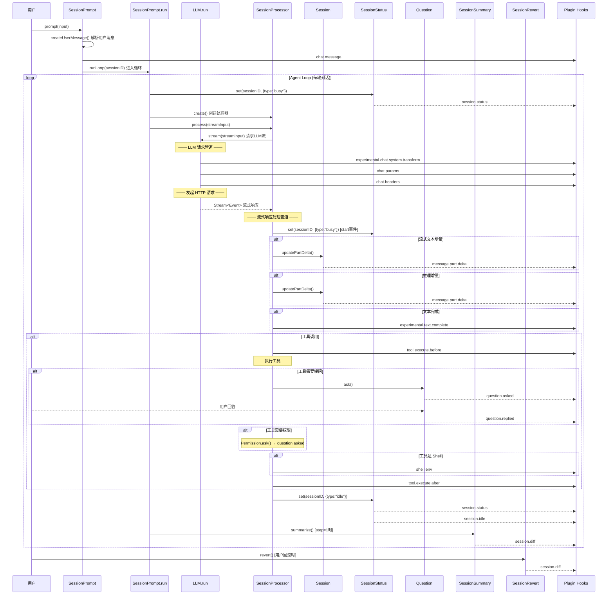
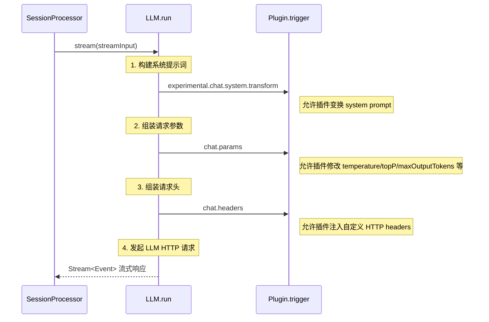
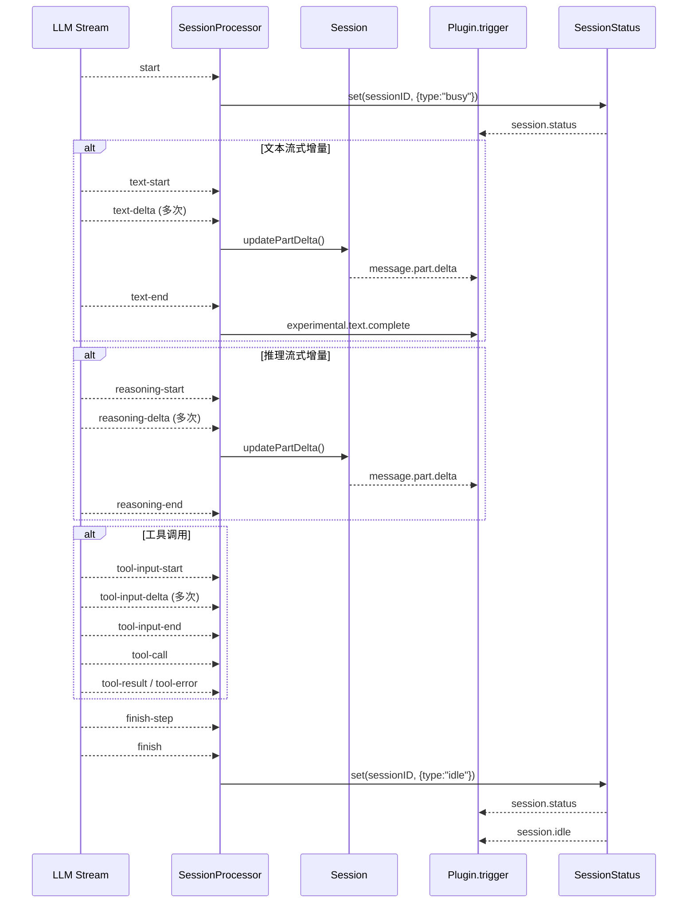
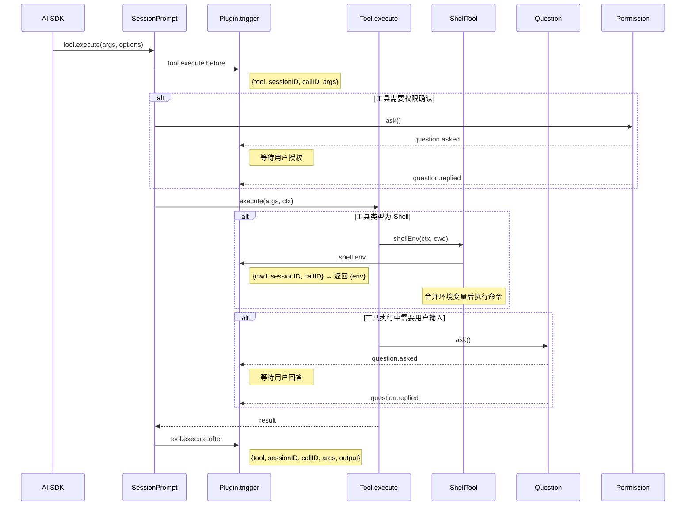
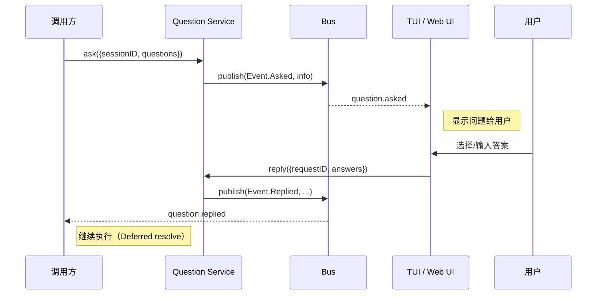
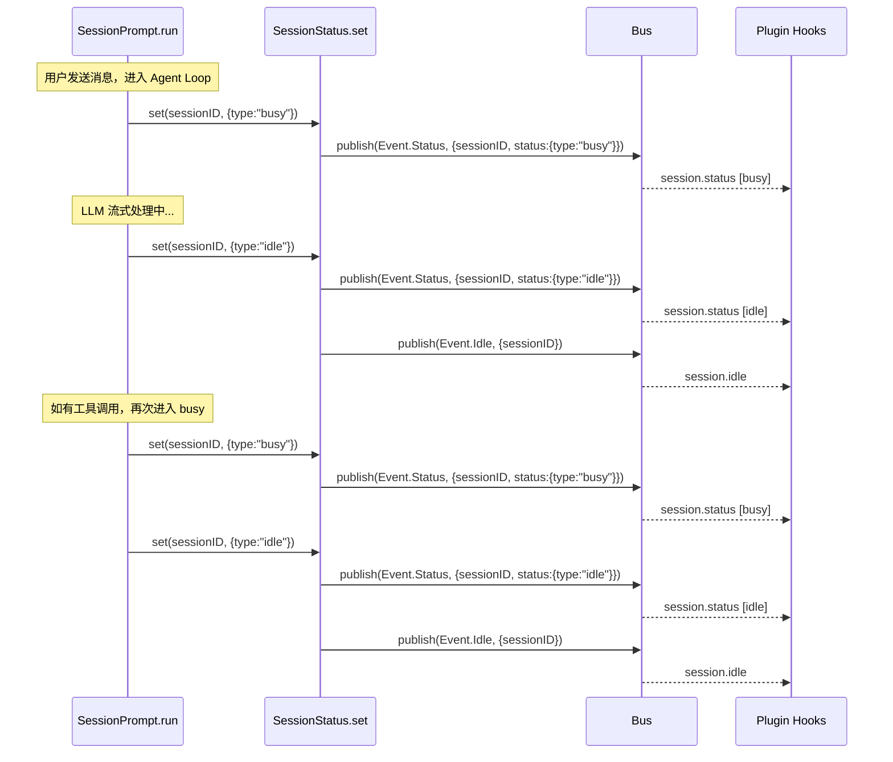
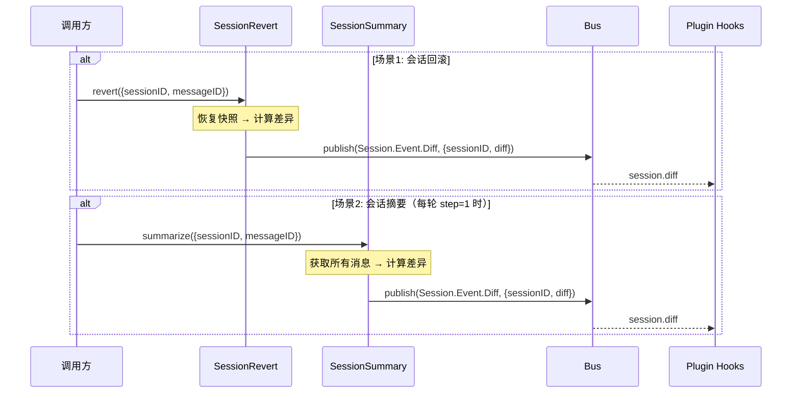

# OpenCode 事件触发业务流程 — 管道时序图

本文档以 Mermaid 时序图形式，展示 14 种日志事件在 opencode 核心业务流程中的触发时序与管道关系。

## 1. 完整会话生命周期总览

## 2. LLM 请求管道（3 个事件）

展示 `LLM.run()` 中 3 个插件钩子的顺序触发：

## 3. 流式响应处理管道（2 个事件）

展示 `SessionProcessor.process()` 处理 LLM 流式响应的事件触发：

## 4. 工具执行管道（3 个事件）

展示工具执行生命周期中 `tool.execute.before` → `shell.env` → `tool.execute.after` 的管道：

## 5. 用户交互管道（2 个事件）

展示 `question.asked` / `question.replied` 的问答流程：

## 6. 会话状态管道（2 个事件）

展示 `session.status` / `session.idle` 的状态流转：

## 7. 会话差异管道（1 个事件）

展示 `session.diff` 在回滚和摘要两种场景下的触发：

## 8. 事件管道汇总图

以管道视角展示所有 14 种事件的触发顺序和数据流向：

```mermaid
flowchart LR
    subgraph 用户输入阶段
        A[用户消息] --> B[chat.message]
    end

    subgraph LLM请求管道
        B --> C[experimental.chat.system.transform]
        C --> D[chat.params]
        D --> E[chat.headers]
    end

    subgraph 流式响应管道
        E --> F[session.status busy]
        F --> G[message.part.delta]
        G --> H[experimental.text.complete]
    end

    subgraph 工具执行管道
        H --> I[tool.execute.before]
        I --> J{需要权限?}
        J -->|是| K[question.asked]
        K --> L[question.replied]
        L --> M{是Shell工具?}
        J -->|否| M
        M -->|是| N[shell.env]
        M -->|否| O[工具执行]
        N --> O
        O --> P[tool.execute.after]
    end

    subgraph 会话状态管道
        P --> Q[session.status idle]
        Q --> R[session.idle]
    end

    subgraph 会话差异管道
        R --> S[session.diff]
    end

    style B fill:#e1f5fe
    style C fill:#fff3e0
    style D fill:#fff3e0
    style E fill:#fff3e0
    style F fill:#e8f5e9
    style G fill:#e8f5e9
    style H fill:#e8f5e9
    style I fill:#fce4ec
    style K fill:#f3e5f5
    style L fill:#f3e5f5
    style N fill:#fce4ec
    style P fill:#fce4ec
    style Q fill:#e8f5e9
    style R fill:#e8f5e9
    style S fill:#e0f2f1
```

> 颜色说明：
> - 蓝色：用户输入事件
> - 橙色：LLM 请求管道事件
> - 绿色：流式响应/会话状态事件
> - 粉色：工具执行事件
> - 紫色：用户交互问答事件
> - 青色：会话差异事件