# handleEvent 函数详细分析

> 源码位置：[`processor.ts:224-620`](../packages/opencode/src/session/processor.ts:224)

`handleEvent` 是一个 Effect 生成器函数（`Effect.fnUntraced`），作为 LLM 流式响应的核心事件处理器。它在 [`process`](../packages/opencode/src/session/processor.ts:535) 函数中通过 `Stream.tap` 被调用，对流中的每个事件进行分发处理。

## 上下文状态变量

| 变量 | 类型 | 作用 |
|------|------|------|
| `ctx.toolcalls` | `Record<string, ToolCall>` | 跟踪进行中的工具调用（key=toolCallID，value 含 Deferred 完成信号） |
| `ctx.reasoningMap` | `Record<string, ReasoningPart>` | 跟踪进行中的推理块（key=reasoningID） |
| `ctx.currentText` | `TextPart \| undefined` | 当前正在生成的文本块 |
| `ctx.snapshot` | `string \| undefined` | 当前步骤的文件系统快照 hash（用于变更检测） |
| `ctx.blocked` | `boolean` | 是否因权限拒绝而阻塞 |
| `ctx.needsCompaction` | `boolean` | 是否需要上下文压缩（溢出时触发，会导致流提前终止） |
| `ctx.shouldBreak` | `boolean` | 权限拒绝时是否中断循环（取决于 `experimental.continue_loop_on_deny` 配置） |
| `ctx.assistantMessage` | `MessageV2.Assistant` | 当前助手消息对象（可变引用） |

## 下游服务依赖

| 服务 | 用途 |
|------|------|
| `session` | 持久化 part/message 到数据库，发布 Bus 事件通知 UI |
| `status` | 更新会话状态（idle/busy/retry） |
| `sync` | 发布同步事件到事件存储 + 可选远端广播 |
| `snapshot` | 文件系统快照的 track/patch/restore |
| `agents` | 获取智能体配置（权限规则集） |
| `permission` | 请求用户权限确认（doom_loop 等） |
| `plugin` | 触发插件钩子（experimental.text.complete） |
| `summary` | 异步生成会话摘要 |
| `config` | 读取配置（compaction、experimental 等） |

---

## 1. `"start"` 事件

> [`processor.ts:226-228`](../packages/opencode/src/session/processor.ts:226)

### 代码

```typescript
case "start":
  yield* status.set(ctx.sessionID, { type: "busy" })
  return
```

### 逻辑

将会话状态设为 `busy`，表示 LLM 正在处理中。UI 收到状态变更后显示加载动画、禁用输入框。

### 示例

```
用户发送 "帮我写一个排序函数"
→ LLM Stream 开始输出，第一个事件是 start
→ status.set(sessionID, { type: "busy" })
→ UI：输入框变灰，显示 "思考中..." 动画
```

### 时序图

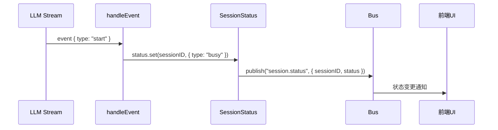

---

## 2. `"reasoning-start"` 事件

> [`processor.ts:230-247`](../packages/opencode/src/session/processor.ts:230)

### 代码

```typescript
case "reasoning-start":
  if (value.id in ctx.reasoningMap) return           // 去重
  yield* sync.run(SessionEvent.Reasoning.Started.Sync, { sessionID, reasoningID: value.id, timestamp })
  ctx.reasoningMap[value.id] = {
    id: PartID.ascending(), messageID, sessionID, type: "reasoning",
    text: "", time: { start: Date.now() }, metadata: value.providerMetadata,
  }
  yield* session.updatePart(ctx.reasoningMap[value.id])
  return
```

### 逻辑

1. **去重**：若 `value.id` 已在 `reasoningMap`（可能因重试），跳过
2. **同步事件**：`session.next.reasoning.started`
3. **创建 ReasoningPart**：空文本、起始时间、providerMetadata，存入 `ctx.reasoningMap`
4. **持久化**：`session.updatePart()` → PartTable + Bus 通知 UI

### 示例

```
模型开始"思考"（extended thinking），流发出第一个推理块：
→ event { type: "reasoning-start", id: "reason_0", providerMetadata: { thinking: true } }
→ reasoningMap["reason_0"] = { type: "reasoning", text: "", time: { start: 1715800000000 } }
→ UI：渲染一个可折叠的"思考过程"区域（当前为空）

去重场景：重试时 AI SDK 可能重发同一 id
→ event { type: "reasoning-start", id: "reason_0" }
→ "reason_0" in reasoningMap === true → return（跳过）
```

### 时序图

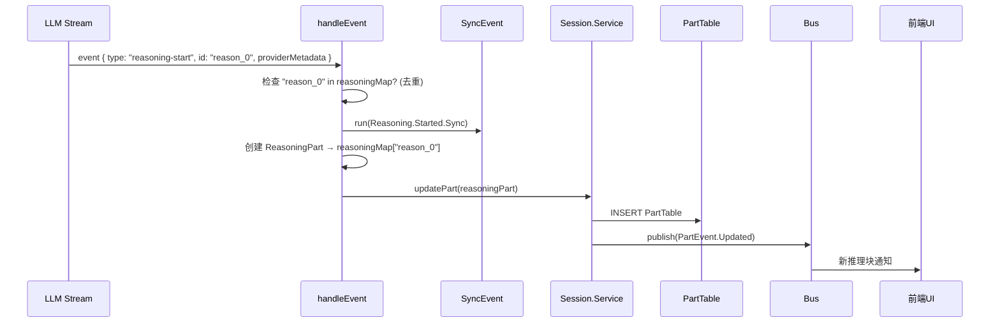

---

## 3. `"reasoning-delta"` 事件

> [`processor.ts:249-266`](../packages/opencode/src/session/processor.ts:249)

### 代码

```typescript
case "reasoning-delta":
  if (!(value.id in ctx.reasoningMap)) return
  ctx.reasoningMap[value.id].text += value.text
  if (value.providerMetadata) ctx.reasoningMap[value.id].metadata = value.providerMetadata
  yield* session.updatePartDelta({ sessionID, messageID, partID, field: "text", delta: value.text })
  yield* sync.run(SessionEvent.Reasoning.Delta.Sync, { sessionID, reasoningID: value.id, delta: value.text, timestamp })
  return
```

### 逻辑

1. **存在性检查**：若不在 map 中（事件乱序），跳过
2. **内存追加**：`reasoningMap[id].text += value.text`
3. **增量持久化**：`session.updatePartDelta()` 仅更新变化部分（高性能）
4. **同步事件**：`session.next.reasoning.delta`

### 示例

```
模型逐步输出思考过程，每个 token 触发一个 delta：
→ event { type: "reasoning-delta", id: "reason_0", text: "用户" }
→ reasoningMap["reason_0"].text = "用户"
→ event { type: "reasoning-delta", id: "reason_0", text: "想要" }
→ reasoningMap["reason_0"].text = "用户想要"
→ event { type: "reasoning-delta", id: "reason_0", text: "排序" }
→ reasoningMap["reason_0"].text = "用户想要排序"
→ UI：实时追加渲染思考文本（打字机效果）

对比 updatePart vs updatePartDelta：
- updatePart：每次全量替换整个 part 记录 → 100 次 delta = 100 次全量写入
- updatePartDelta：每次只追加 delta 到 text 字段 → 100 次 delta = 100 次增量追加（性能更优）
```

### 时序图

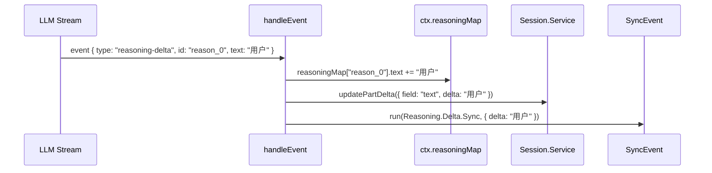

---

## 4. `"reasoning-end"` 事件

> [`processor.ts:268-282`](../packages/opencode/src/session/processor.ts:268)

### 代码

```typescript
case "reasoning-end":
  if (!(value.id in ctx.reasoningMap)) return
  yield* sync.run(SessionEvent.Reasoning.Ended.Sync, { sessionID, reasoningID: value.id, text, timestamp })
  ctx.reasoningMap[value.id].text = ctx.reasoningMap[value.id].text   // 响应式触发
  ctx.reasoningMap[value.id].time = { ...ctx.reasoningMap[value.id].time, end: Date.now() }
  if (value.providerMetadata) ctx.reasoningMap[value.id].metadata = value.providerMetadata
  yield* session.updatePart(ctx.reasoningMap[value.id])               // 全量更新
  delete ctx.reasoningMap[value.id]
  return
```

### 逻辑

1. **存在性检查**：若不在 map 中则跳过
2. **同步事件**：`session.next.reasoning.ended`，含完整文本
3. **响应式触发**：`text = text` 自赋值，触发响应式系统变更检测
4. **全量更新**：`session.updatePart()` 完整替换 part（含最终文本、结束时间、metadata）
5. **清理**：从 `reasoningMap` 中删除

### 示例

```
模型思考完毕：
→ event { type: "reasoning-end", id: "reason_0", providerMetadata: null }
→ sync.run(Reasoning.Ended.Sync, { text: "用户想要排序，我应该使用快速排序..." })
→ reasoningMap["reason_0"].text = reasoningMap["reason_0"].text  // 响应式触发
→ reasoningMap["reason_0"].time.end = 1715800005000
→ updatePart({ text: "用户想要排序，我应该使用快速排序...", time: { start: ..., end: ... } })
→ delete reasoningMap["reason_0"]

UI 状态变化：
- 思考区域从"展开+打字机动画" → 折叠，显示"思考了 5 秒"
```

### 时序图

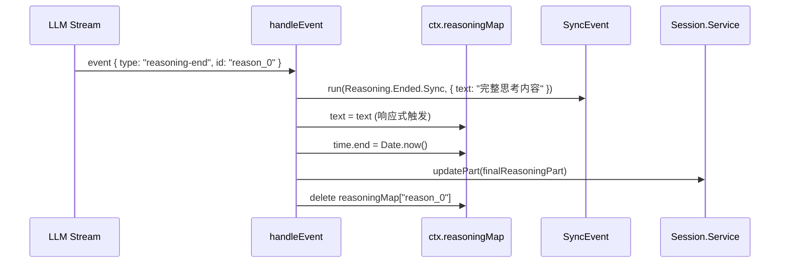

---

## 5. `"tool-input-start"` 事件

> [`processor.ts:284-310`](../packages/opencode/src/session/processor.ts:284)

### 代码

```typescript
case "tool-input-start":
  if (ctx.assistantMessage.summary) {
    throw new Error(`Tool call not allowed while generating summary: ${value.toolName}`)
  }
  yield* sync.run(SessionEvent.Tool.Input.Started.Sync, { sessionID, callID: value.id, name: value.toolName, timestamp })
  const part = yield* session.updatePart({
    id: ctx.toolcalls[value.id]?.partID ?? PartID.ascending(),
    messageID, sessionID, type: "tool", tool: value.toolName, callID: value.id,
    state: { status: "pending", input: {}, raw: "" },
    metadata: value.providerExecuted ? { providerExecuted: true } : undefined,
  })
  ctx.toolcalls[value.id] = {
    done: yield* Deferred.make<void>(), partID: part.id, messageID: part.messageID, sessionID: part.sessionID,
  }
  return
```

### 逻辑

1. **Summary 守卫**：正在生成摘要时禁止工具调用，抛出错误
2. **同步事件**：`session.next.tool.input.started`
3. **创建 ToolPart**：状态 `"pending"`，若 `ctx.toolcalls[value.id]` 已存在（重试）则复用 partID
4. **Deferred 信号**：创建 `Deferred<void>` 作为完成信号，供 `cleanup`/`settleToolCall` 使用

### 示例

```
模型决定读取文件，开始输出工具调用参数：
→ event { type: "tool-input-start", id: "call_abc123", toolName: "read_file", providerExecuted: false }
→ 创建 ToolPart { tool: "read_file", callID: "call_abc123", state: { status: "pending", input: {} } }
→ toolcalls["call_abc123"] = { done: Deferred, partID: "part_001", ... }
→ UI：显示一个 "read_file" 工具卡片，状态 "等待参数输入..."

Summary 守卫场景：
→ 如果 ctx.assistantMessage.summary 存在（正在压缩摘要）
→ event { type: "tool-input-start", toolName: "read_file" }
→ throw Error("Tool call not allowed while generating summary: read_file")
→ 原因：摘要生成是只读操作，不应触发工具调用

重试复用 partID 场景：
→ 第一次尝试：toolcalls["call_abc123"] = { partID: "part_001", ... }
→ 网络错误，触发重试
→ 第二次尝试：event { type: "tool-input-start", id: "call_abc123" }
→ ctx.toolcalls["call_abc123"] 已存在 → 复用 partID: "part_001"
→ 避免创建重复的 Part 记录

providerExecuted 场景（如 OpenAI 的 function_calling）：
→ event { type: "tool-input-start", id: "call_xyz", toolName: "web_search", providerExecuted: true }
→ ToolPart.metadata = { providerExecuted: true }
→ 后续 tool-call/tool-result 时会保留此标记，表示该工具由 Provider 端执行
```

### 时序图

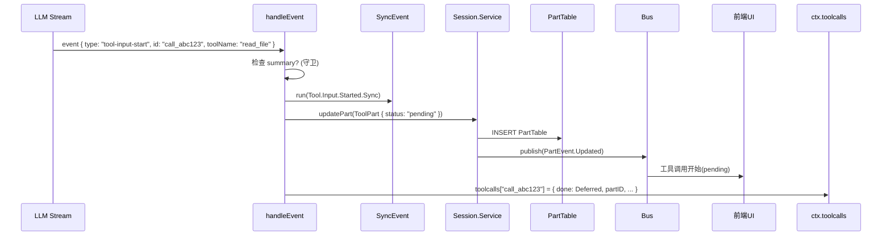

---

## 6. `"tool-input-delta"` 事件

> [`processor.ts:312-319`](../packages/opencode/src/session/processor.ts:312)

### 代码

```typescript
case "tool-input-delta":
  yield* sync.run(SessionEvent.Tool.Input.Delta.Sync, { sessionID, callID: value.id, delta: value.delta, timestamp })
  return
```

### 逻辑

仅发送同步事件，**不更新数据库 part**。工具输入增量由 AI SDK 内部累积，最终在 `tool-call` 中一次性传入完整 input。

### 示例

```
模型正在流式生成工具参数 JSON：
→ event { type: "tool-input-delta", id: "call_abc123", delta: '{"file' }
→ event { type: "tool-input-delta", id: "call_abc123", delta: '_path":"' }
→ event { type: "tool-input-delta", id: "call_abc123", delta: '/src/ind' }
→ event { type: "tool-input-delta", id: "call_abc123", delta: 'ex.ts"}' }
→ 每次 delta 只记录到 SyncEvent，不写数据库
→ AI SDK 内部累积：input = '{"file_path":"/src/index.ts"}'
→ 最终在 tool-call 事件中一次性传入完整 input
```

### 时序图

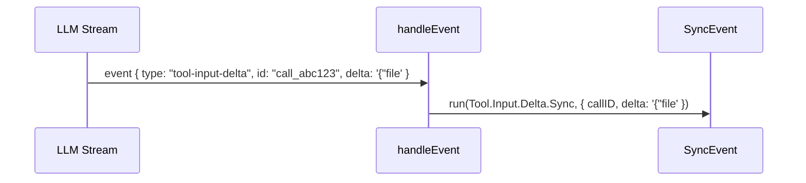

---

## 7. `"tool-input-end"` 事件

> [`processor.ts:321-329`](../packages/opencode/src/session/processor.ts:321)

### 代码

```typescript
case "tool-input-end": {
  yield* sync.run(SessionEvent.Tool.Input.Ended.Sync, { sessionID, callID: value.id, text: "", timestamp })
  return
}
```

### 逻辑

仅发送同步事件，text 固定为空字符串。同样不更新数据库 part。

### 示例

```
工具参数 JSON 输出完毕：
→ event { type: "tool-input-end", id: "call_abc123" }
→ sync.run(Tool.Input.Ended.Sync, { callID: "call_abc123", text: "" })
→ 注意：text 固定为空，因为实际参数已在 tool-call 中传递
```

---

## 8. `"tool-call"` 事件

> [`processor.ts:331-387`](../packages/opencode/src/session/processor.ts:331)

### 代码

```typescript
case "tool-call": {
  if (ctx.assistantMessage.summary) throw new Error(...)
  const toolCall = yield* readToolCall(value.toolCallId)
  yield* sync.run(SessionEvent.Tool.Called.Sync, { sessionID, callID, tool: value.toolName, input: value.input, provider, timestamp })
  yield* updateToolCall(value.toolCallId, (match) => ({
    ...match, tool: value.toolName,
    state: { ...match.state, status: "running", input: value.input, time: { start: Date.now() } },
    metadata: match.metadata?.providerExecuted ? { ...value.providerMetadata, providerExecuted: true } : value.providerMetadata,
  }))
  // 末日循环检测
  const parts = MessageV2.parts(ctx.assistantMessage.id)
  const recentParts = parts.slice(-DOOM_LOOP_THRESHOLD)  // = 3
  if (recentParts.length !== DOOM_LOOP_THRESHOLD || !recentParts.every(...)) return
  const agent = yield* agents.get(ctx.assistantMessage.agent)
  yield* permission.ask({ permission: "doom_loop", patterns: [value.toolName], ... })
  return
}
```

### 逻辑

1. **Summary 守卫**：同 `tool-input-start`
2. **读取已有调用**：`readToolCall()` 从数据库读取之前创建的 ToolPart
3. **同步事件**：`session.next.tool.called`
4. **状态转换**：`updateToolCall()` 将 ToolPart 从 `"pending"` → `"running"`，设置完整 input 和 time.start
5. **末日循环检测**：取最近 3 个 parts，若全部是同一工具+同一输入+非 pending → 触发 `permission.ask("doom_loop")`

### 示例

```
正常工具调用：
→ event { type: "tool-call", toolCallId: "call_abc123", toolName: "read_file", input: { file_path: "/src/index.ts" } }
→ readToolCall("call_abc123") → ToolPart { status: "pending" }
→ updateToolCall → ToolPart { status: "running", input: { file_path: "/src/index.ts" }, time: { start: 1715800001 } }
→ UI：工具卡片从 "等待参数" 变为 "正在执行..."

末日循环检测场景：
假设 LLM 反复调用同一工具，产生了如下 parts 序列：
  part_1: { type: "tool", tool: "bash", state: { status: "completed", input: { command: "npm test" } } }
  part_2: { type: "tool", tool: "bash", state: { status: "completed", input: { command: "npm test" } } }
  part_3: (当前) { type: "tool-call", toolName: "bash", input: { command: "npm test" } }

→ recentParts = [part_1, part_2, part_3]
→ 3 个 parts 全部满足：tool === "bash" + input 相同 + status !== "pending"
→ 判定为末日循环！
→ permission.ask({ permission: "doom_loop", patterns: ["bash"] })
→ UI：弹出对话框 "bash 已连续调用3次且参数相同，是否继续？"
→ 用户可以选择 "继续"、"停止" 或 "始终允许 bash"

非末日循环场景：
  part_1: { tool: "read_file", input: { file_path: "/a.ts" } }  ← 不同文件
  part_2: { tool: "read_file", input: { file_path: "/b.ts" } }  ← 不同文件
  part_3: { tool: "read_file", input: { file_path: "/c.ts" } }  ← 不同文件
→ input 不同 → 不是末日循环 → 正常继续
```

### 时序图

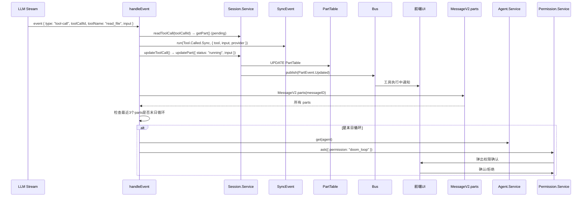

---

## 9. `"tool-result"` 事件

> [`processor.ts:389-442`](../packages/opencode/src/session/processor.ts:389)

### 代码

```typescript
case "tool-result": {
  const toolCall = yield* readToolCall(value.toolCallId)
  const toolAttachments = (Array.isArray(value.output.attachments) ? value.output.attachments : [])
    .filter((a): a is MessageV2.FilePart => isRecord(a) && a.type === "file" && typeof a.mime === "string" && typeof a.url === "string")
  const normalized = yield* Effect.forEach(toolAttachments, (a) => Effect.succeed(Exit.succeed(a)))
  const omitted = normalized.filter(Exit.isFailure).length
  const attachments = normalized.filter(Exit.isSuccess).map((item) => item.value)
  const output = {
    ...value.output,
    output: omitted === 0 ? value.output.output
      : `${value.output.output}\n\n[${omitted} image${omitted === 1 ? "" : "s"} omitted: could not be resized below the image size limit.]`,
    attachments: attachments?.length ? attachments : undefined,
  }
  yield* sync.run(SessionEvent.Tool.Success.Sync, { sessionID, callID, structured, content, provider, timestamp })
  yield* completeToolCall(value.toolCallId, output)
  return
}
```

### 逻辑

1. **读取已有调用**：`readToolCall()` 获取当前 ToolPart
2. **附件验证**：过滤出合法 FilePart（含 `type: "file"`, `mime: string`, `url: string`）
3. **附件标准化**：当前直接通过（图片规范化已临时禁用）
4. **省略计数**：标准化失败数 >0 时追加省略提示
5. **同步事件**：`session.next.tool.success`
6. **完成调用**：`completeToolCall()` → 状态 `"running"` → `"completed"`

### 示例

```
无附件的工具结果（如 read_file）：
→ event { type: "tool-result", toolCallId: "call_abc123",
    output: { output: "export function sort(arr) {...}", title: "read_file", metadata: {} } }
→ attachments = [] (无附件)
→ completeToolCall → ToolPart { status: "completed", output: "export function sort(arr) {...}" }
→ UI：工具卡片显示文件内容

带附件的工具结果（如 screenshot）：
→ event { type: "tool-result", toolCallId: "call_xyz",
    output: { output: "截图已保存", title: "screenshot", metadata: {},
      attachments: [
        { type: "file", mime: "image/png", url: "file:///tmp/screenshot.png", filename: "screenshot.png" },
        { type: "file", mime: "image/png", url: "file:///tmp/screenshot2.png", filename: "screenshot2.png" },
      ] } }
→ 两个附件都通过验证 (type==="file", mime 是 string, url 是 string)
→ completeToolCall → ToolPart { status: "completed", output: "截图已保存",
    attachments: [{ mime: "image/png", url: "..." }, { mime: "image/png", url: "..." }] }

非法附件被过滤的场景：
→ attachments: [
    { type: "file", mime: "image/png", url: "/ok.png" },    ← 合法，保留
    { type: "image", mime: "image/png" },                    ← type !== "file"，过滤
    { type: "file", mime: 123, url: "/bad.png" },            ← mime 不是 string，过滤
  ]
→ toolAttachments 只保留第一个
→ omitted = 0 → output 不变
```

### 时序图

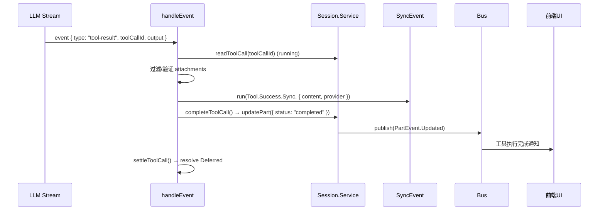

---

## 11. `"error"` 事件

> [`processor.ts:462-463`](../packages/opencode/src/session/processor.ts:462)

### 代码

```typescript
case "error":
  throw value.error
```

### 逻辑

直接抛出错误，由外层 `process` 管道处理：`catchCauseIf` → `retry(SessionRetry.policy)` → `catch(halt)`。

`halt()` 逻辑：
- `ContextOverflowError` → `ctx.needsCompaction = true` + Bus 错误通知
- 其他错误 → `Step.Failed` 同步事件 + `assistantMessage.error` + Bus 错误通知 + `status.set(idle)`

### 示例

```
API 返回 429 限流错误：
→ event { type: "error", error: APICallError { statusCode: 429, message: "Rate limit exceeded" } }
→ throw error → 被外层 catchCauseIf 捕获
→ SessionRetry.policy 判断：429 是可重试错误 → 等待 2s 后重试
→ 重试成功 → 继续处理流

API 返回 401 认证错误（不可重试）：
→ event { type: "error", error: APICallError { statusCode: 401 } }
→ throw error → 重试策略判断不可重试 → halt(error)
→ halt: 非 ContextOverflowError → sync.run(Step.Failed) + assistantMessage.error = APIError
→ status.set(idle) → UI：显示错误 "认证失败"

上下文溢出错误：
→ event { type: "error", error: ContextOverflowError { message: "Token usage exceeds limit" } }
→ throw error → 重试耗尽 → halt(error)
→ halt: ContextOverflowError → ctx.needsCompaction = true
→ process() 检测到 needsCompaction → 返回 "compact"
→ 上层 runloop 触发上下文压缩流程
```

### 时序图

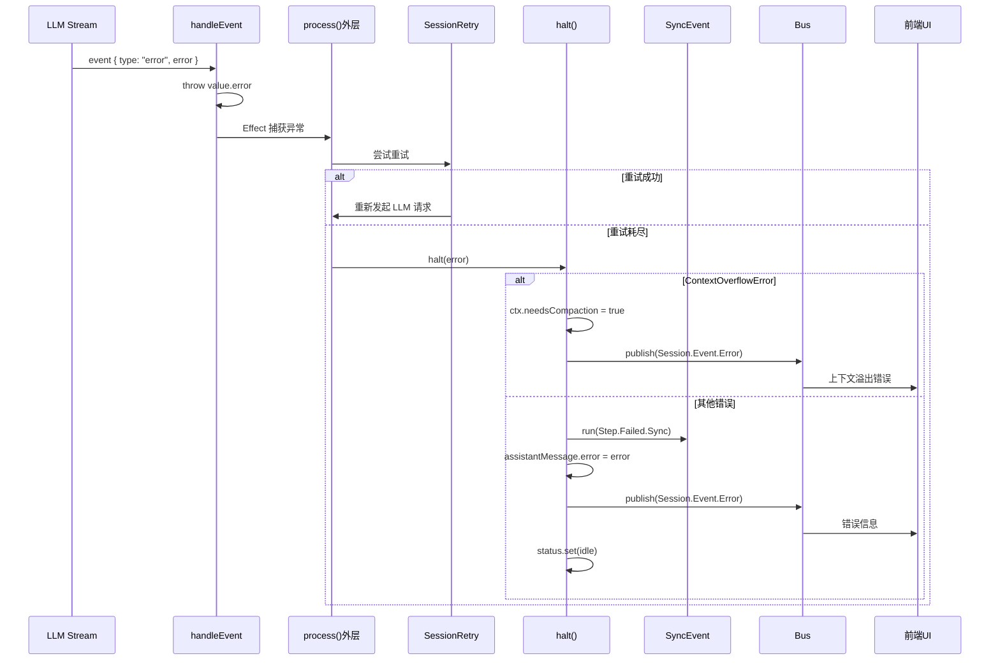

---

## 12. `"start-step"` 事件

> [`processor.ts:465-487`](../packages/opencode/src/session/processor.ts:465)

### 代码

```typescript
case "start-step":
  if (!ctx.snapshot) ctx.snapshot = yield* snapshot.track()
  if (!ctx.assistantMessage.summary) {
    yield* sync.run(SessionEvent.Step.Started.Sync, { sessionID, agent, model, snapshot, timestamp })
  }
  yield* session.updatePart({ id: PartID.ascending(), messageID, sessionID, snapshot, type: "step-start" })
  return
```

### 逻辑

1. **快照捕获**：若 `ctx.snapshot` 为空，调用 `snapshot.track()` 获取 git tree hash（快照在 `create()` 时会预捕获一次）
2. **同步事件**（非 summary）：`session.next.step.started`，含 agent、model、snapshot
3. **持久化 StepStartPart**

### 示例

```
LLM 开始新一轮推理步骤：
→ event { type: "start-step" }
→ ctx.snapshot 为空（首次或前步已消费）→ snapshot.track()
  → 执行 git add -A && git write-tree → 返回 "abc1234"（当前工作区快照）
→ sync.run(Step.Started.Sync, { agent: "code", model: { id: "claude-3.5-sonnet", providerID: "anthropic" }, snapshot: "abc1234" })
→ updatePart({ type: "step-start", snapshot: "abc1234" })
→ UI：显示步骤分隔线 "Step 2"

快照已存在场景（由 create() 预捕获）：
→ ctx.snapshot = "abc1234"（不为空）
→ 不调用 snapshot.track()，直接使用已有快照
→ 原因：AI SDK 可能内部执行工具后再发 start-step，此时需要确保快照是最早的状态
```

### 时序图

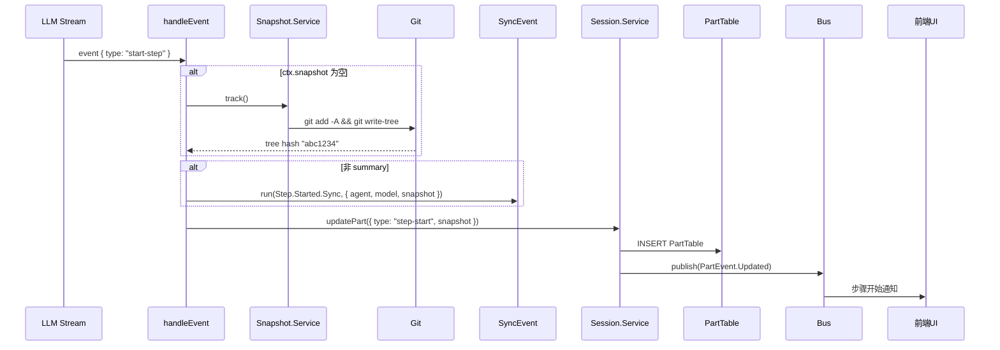

---

## 13. `"finish-step"` 事件

> [`processor.ts:489-547`](../packages/opencode/src/session/processor.ts:489)

逻辑最复杂的事件，涉及用量计算、文件变更检测、摘要生成、溢出检测。

### 代码

```typescript
case "finish-step": {
  const completedSnapshot = yield* snapshot.track()
  const usage = Session.getUsage({ model: ctx.model, usage: value.usage, metadata: value.providerMetadata })
  if (!ctx.assistantMessage.summary) {
    yield* sync.run(SessionEvent.Step.Ended.Sync, { sessionID, finish, cost, tokens, snapshot, timestamp })
  }
  ctx.assistantMessage.finish = value.finishReason
  ctx.assistantMessage.cost += usage.cost
  ctx.assistantMessage.tokens = usage.tokens
  yield* session.updatePart({ id, reason, snapshot: completedSnapshot, type: "step-finish", tokens, cost })
  yield* session.updateMessage(ctx.assistantMessage)
  if (ctx.snapshot) {
    const patch = yield* snapshot.patch(ctx.snapshot)
    if (patch.files.length) {
      yield* session.updatePart({ id, type: "patch", hash: patch.hash, files: patch.files })
    }
    ctx.snapshot = undefined
  }
  yield* summary.summarize({ sessionID, messageID }).pipe(Effect.ignore, Effect.forkIn(scope))
  if (!ctx.assistantMessage.summary && isOverflow({ cfg: yield* config.get(), tokens, model })) {
    ctx.needsCompaction = true
  }
  return
```

### 逻辑

1. **完成时快照**：`snapshot.track()` 获取步骤结束时的文件系统状态
2. **用量计算**：`Session.getUsage()` 计算 token 用量和费用
3. **同步事件**（非 summary）：`session.next.step.ended`
4. **更新消息**：累积 cost、更新 tokens 和 finishReason
5. **持久化 StepFinishPart**
6. **更新消息**：`session.updateMessage()` 写入数据库
7. **文件变更检测**：`snapshot.patch()` 计算差异 → 若有变更创建 `PatchPart`，消费快照
8. **异步摘要**：`summary.summarize()` 在独立 fiber 中异步运行（不阻塞）
9. **溢出检测**：`isOverflow()` → `ctx.needsCompaction = true` → 流终止 → `process` 返回 `"compact"`

### 示例

```
完整场景：模型读取文件、修改文件、完成一轮推理

步骤开始时：ctx.snapshot = "abc1234"（记录了修改前的文件状态）
→ 模型执行 write_file 工具，修改了 /src/sort.ts
→ event { type: "finish-step", finishReason: "tool-calls", usage: { inputTokens: 5000, outputTokens: 800 } }

1. 完成时快照：snapshot.track() → "def5678"（修改后的文件状态）
2. 用量计算：getUsage() → { cost: 0.024, tokens: { input: 5000, output: 800 } }
3. 同步事件：Step.Ended.Sync { finish: "tool-calls", cost: 0.024, tokens: {...} }
4. 更新消息：assistantMessage.cost += 0.024, tokens = { input: 5000, output: 800 }
5. 持久化：updatePart({ type: "step-finish", reason: "tool-calls", cost: 0.024 })
6. 更新消息：updateMessage(assistantMessage) → 数据库
7. 文件变更检测：
   → snapshot.patch("abc1234") → git diff-tree "abc1234" vs "def5678"
   → Patch { hash: "patch_001", files: ["/src/sort.ts"] }
   → 有变更 → updatePart({ type: "patch", hash: "patch_001", files: ["/src/sort.ts"] })
   → ctx.snapshot = undefined（消费快照）
   → UI：显示"1 个文件被修改"标签
8. 异步摘要：summary.summarize() → 后台生成会话标题（不阻塞）
9. 溢出检测：isOverflow({ tokens: { input: 5000 }, model: { limit: { context: 200000 } } }) → false → 不需要压缩

上下文溢出场景：
→ 累积了大量对话历史，inputTokens = 190000
→ model.limit.context = 200000, reserved = 20000
→ usable = 200000 - 20000 = 180000
→ 190000 >= 180000 → isOverflow = true
→ ctx.needsCompaction = true
→ Stream.takeUntil(() => ctx.needsCompaction) 终止流
→ process() 返回 "compact" → runloop 触发上下文压缩

无文件变更场景：
→ 模型只做了文本回复，没有执行写文件工具
→ snapshot.patch("abc1234") → Patch { hash: "patch_002", files: [] }
→ files.length === 0 → 不创建 PatchPart
→ ctx.snapshot = undefined
```

### 时序图

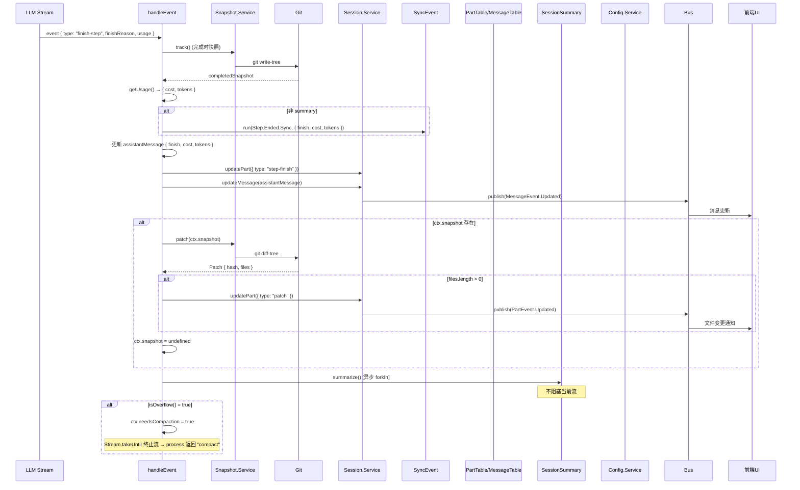

---

## 14. `"text-start"` 事件

> [`processor.ts:549-566`](../packages/opencode/src/session/processor.ts:549)

### 代码

```typescript
case "text-start":
  if (!ctx.assistantMessage.summary) {
    yield* sync.run(SessionEvent.Text.Started.Sync, { sessionID, timestamp })
  }
  ctx.currentText = {
    id: PartID.ascending(), messageID, sessionID, type: "text",
    text: "", time: { start: Date.now() }, metadata: value.providerMetadata,
  }
  yield* session.updatePart(ctx.currentText)
  return
```

### 逻辑

1. **同步事件**（非 summary）：`session.next.text.started`
2. **创建 TextPart**：空文本、起始时间、providerMetadata，存入 `ctx.currentText`
3. **持久化**：`session.updatePart()`

### 示例

```
模型开始输出文本回复：
→ event { type: "text-start", providerMetadata: null }
→ currentText = { type: "text", text: "", time: { start: 1715800010000 } }
→ updatePart(currentText) → UI：渲染一个空的文本区域

Summary 模式场景：
→ ctx.assistantMessage.summary 存在（正在压缩摘要）
→ 不发送同步事件（summary 不对外广播）
→ 但仍然创建 TextPart 和持久化（summary 内容也需要存储）
```

### 时序图

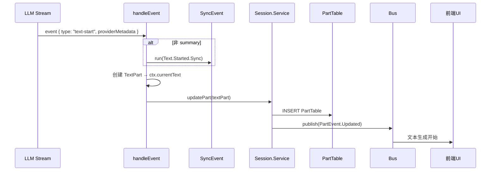

---

## 15. `"text-delta"` 事件

> [`processor.ts:568-584`](../packages/opencode/src/session/processor.ts:568)

### 代码

```typescript
case "text-delta":
  if (!ctx.currentText) return
  ctx.currentText.text += value.text
  if (value.providerMetadata) ctx.currentText.metadata = value.providerMetadata
  yield* session.updatePartDelta({ sessionID, messageID, partID, field: "text", delta: value.text })
  yield* sync.run(SessionEvent.Text.Delta.Sync, { sessionID, delta: value.text, timestamp })
  return
```

### 逻辑

1. **存在性检查**：`ctx.currentText` 为空则跳过
2. **内存追加**：`currentText.text += value.text`
3. **增量持久化**：`session.updatePartDelta()`
4. **同步事件**：`session.next.text.delta`

### 示例

```
模型流式输出回复，每个 token 触发一个 delta：
→ event { type: "text-delta", text: "这是" }
→ currentText.text = "这是"
→ event { type: "text-delta", text: "一个" }
→ currentText.text = "这是一个"
→ event { type: "text-delta", text: "快速" }
→ currentText.text = "这是一个快速"
→ event { type: "text-delta", text: "排序" }
→ currentText.text = "这是一个快速排序"
→ UI：实时追加渲染文本（打字机效果）

currentText 为空的异常场景（事件乱序）：
→ 如果 text-delta 在 text-start 之前到达（理论上不应发生）
→ ctx.currentText === undefined → return（跳过，等待 text-start）
```

### 时序图

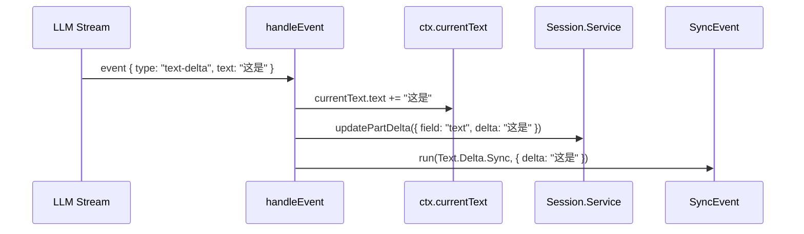

---

## 16. `"text-end"` 事件

> [`processor.ts:586-613`](../packages/opencode/src/session/processor.ts:586)

### 代码

```typescript
case "text-end":
  if (!ctx.currentText) return
  ctx.currentText.text = ctx.currentText.text                    // 响应式触发
  ctx.currentText.text = (yield* plugin.trigger(
    "experimental.text.complete",
    { sessionID, messageID, partID }, { text: ctx.currentText.text },
  )).text
  if (!ctx.assistantMessage.summary) {
    yield* sync.run(SessionEvent.Text.Ended.Sync, { sessionID, text, timestamp })
  }
  { const end = Date.now(); ctx.currentText.time = { start: ctx.currentText.time?.start ?? end, end } }
  if (value.providerMetadata) ctx.currentText.metadata = value.providerMetadata
  yield* session.updatePart(ctx.currentText)
  ctx.currentText = undefined
  return
```

### 逻辑

1. **存在性检查**：`ctx.currentText` 为空则跳过
2. **响应式触发**：`text = text` 自赋值
3. **插件钩子**：`experimental.text.complete` — 唯一的插件干预点，可修改最终文本
4. **同步事件**（非 summary）：`session.next.text.ended`
5. **全量更新**：`session.updatePart()` 完整替换 part
6. **清理**：`ctx.currentText = undefined`

### 示例

```
正常文本完成：
→ event { type: "text-end" }
→ currentText.text = "这是一个快速排序算法的实现"
→ plugin.trigger("experimental.text.complete", { text: "这是一个快速排序算法的实现" })
  → 无插件注册 → 返回原文本
→ sync.run(Text.Ended.Sync, { text: "这是一个快速排序算法的实现" })
→ currentText.time.end = 1715800015000
→ updatePart(currentText) → 数据库全量更新
→ currentText = undefined

插件修改文本场景：
→ plugin.trigger("experimental.text.complete", { text: "密码是 secret123" })
  → 安全过滤插件检测到敏感信息
  → 返回 { text: "密码是 [REDACTED]" }
→ currentText.text = "密码是 [REDACTED]"（文本被修改）
→ sync.run(Text.Ended.Sync, { text: "密码是 [REDACTED]" })
→ 最终存储的是过滤后的文本

计时场景：
→ currentText.time = { start: 1715800010000, end: 1715800015000 }
→ UI：显示"生成耗时 5 秒"
```

### 时序图

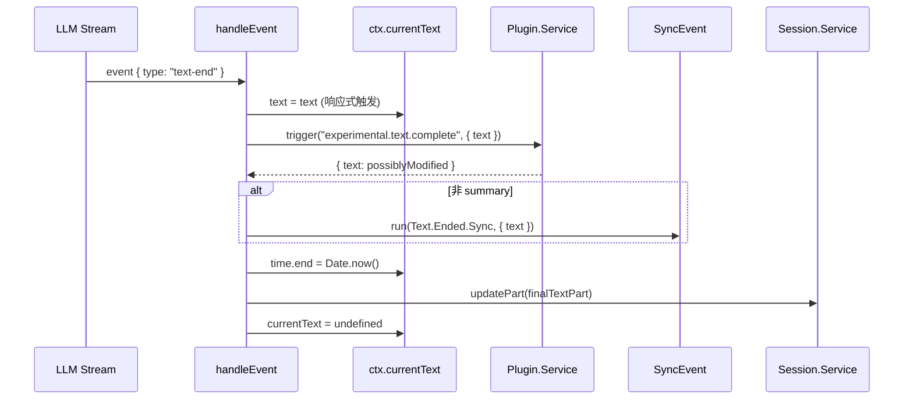

---

## 17. `"finish"` 事件

> [`processor.ts:615-616`](../packages/opencode/src/session/processor.ts:615)

### 代码

```typescript
case "finish":
  return
```

### 逻辑

空操作。实际收尾由 `process` 函数的 `Effect.ensuring(cleanup())` 和流结束后的返回值判断完成。

### 示例

```
LLM 流结束：
→ event { type: "finish" }
→ return（不做任何处理）

后续流程（不在 handleEvent 中，而在 process() 中）：
1. Stream.runDrain 完成
2. Effect.ensuring(cleanup()) 触发：
   - 保存未消费的 snapshot patch
   - 关闭未完成的 currentText（设 time.end）
   - 关闭未完成的 reasoningMap 条目
   - 等待所有 toolcalls 的 Deferred（最多 250ms）
   - 将仍在 running 的工具标记为 error("Tool execution aborted")
   - 设置 assistantMessage.time.completed
3. 判断返回值：
   - needsCompaction? → "compact"
   - blocked || error? → "stop"
   - 否则 → "continue"（继续 runloop 循环）
```

---

## 18. `default` — 未知事件

> [`processor.ts:618-620`](../packages/opencode/src/session/processor.ts:618)

### 代码

```typescript
default:
  slog.info("unhandled", { event: value.type, value })
  return
```

### 逻辑

仅记录日志，不抛错。防御性编程。

### 示例

```
AI SDK 新增了事件类型（如 "reasoning-summary-delta"）：
→ event { type: "reasoning-summary-delta", ... }
→ slog.info("unhandled", { event: "reasoning-summary-delta", value: {...} })
→ return（不影响已支持的事件处理）

设计意义：新版本 AI SDK 可能新增事件类型，default 分支确保不会导致处理器崩溃，
只是静默忽略，等待 opencode 适配新事件。
```

---

## 附录：事件处理总览

| 事件 | 行号 | 下游服务 | ctx 状态变更 | 关键副作用 |
|------|------|---------|-------------|-----------|
| `start` | 226-228 | status | - | 设置会话 busy |
| `reasoning-start` | 230-247 | sync, session | reasoningMap += | 创建 ReasoningPart |
| `reasoning-delta` | 249-266 | session, sync | reasoningMap[id].text += | 增量更新 |
| `reasoning-end` | 268-282 | sync, session | delete reasoningMap[id] | 全量更新+时间 |
| `tool-input-start` | 284-310 | sync, session | toolcalls += | 创建 ToolPart(pending) + Deferred |
| `tool-input-delta` | 312-319 | sync | - | 仅事件通知 |
| `tool-input-end` | 321-329 | sync | - | 仅事件通知 |
| `tool-call` | 331-387 | session, sync, agents, permission | - | pending→running + 末日循环检测 |
| `tool-result` | 389-442 | session, sync | delete toolcalls[id] | running→completed |
| `tool-error` | 444-460 | session, sync | blocked?, delete toolcalls[id] | running→error + blocked? |
| `error` | 462-463 | (外层处理) | needsCompaction? | 抛出异常 |
| `start-step` | 465-487 | snapshot, sync, session | snapshot? | 创建 StepStartPart |
| `finish-step` | 489-547 | snapshot, sync, session, summary, config | snapshot=undefined, needsCompaction? | StepFinish + Patch + 摘要 + 溢出检测 |
| `text-start` | 549-566 | sync, session | currentText += | 创建 TextPart |
| `text-delta` | 568-584 | session, sync | currentText.text += | 增量更新 |
| `text-end` | 586-613 | plugin, sync, session | currentText=undefined | 插件钩子+全量更新 |
| `finish` | 615-616 | - | - | 空操作 |
| `default` | 618-620 | slog | - | 记录日志 |

### `process` 返回值与 ctx 状态的关系

```typescript
if (ctx.needsCompaction) return "compact"                              // finish-step / error 触发
if (ctx.blocked || ctx.assistantMessage.error) return "stop"           // tool-error / error 触发
return "continue"                                                      // 正常继续循环
```, delete toolcalls[id]
```

---

## 10. `"tool-error"` 事件

> [`processor.ts:444-460`](../packages/opencode/src/session/processor.ts:444)

### 代码

```typescript
case "tool-error": {
  const toolCall = yield* readToolCall(value.toolCallId)
  yield* sync.run(SessionEvent.Tool.Failed.Sync, { sessionID, callID, error, provider, timestamp })
  yield* failToolCall(value.toolCallId, value.error)
  return
}
```

`failToolCall()` 内部：状态 `"running"` → `"error"`，若错误为 `Permission.RejectedError` 或 `Question.RejectedError`，则设置 `ctx.blocked = ctx.shouldBreak`。

### 示例

```
工具执行抛出异常（如文件不存在）：
→ event { type: "tool-error", toolCallId: "call_abc123", error: new Error("ENOENT: no such file") }
→ failToolCall → ToolPart { status: "error", error: "ENOENT: no such file" }
→ ctx.blocked 未改变（普通错误不影响 blocked）
→ UI：工具卡片显示红色错误信息 "ENOENT: no such file"

用户拒绝权限场景：
→ LLM 尝试执行 bash 命令 "rm -rf /"
→ permission.ask() → 用户点击"拒绝"
→ 抛出 Permission.RejectedError
→ event { type: "tool-error", toolCallId: "call_xyz", error: Permission.RejectedError }
→ failToolCall:
  - ToolPart { status: "error", error: "Permission denied" }
  - ctx.blocked = ctx.shouldBreak
  - 若 shouldBreak = true（默认）→ blocked = true → process() 返回 "stop" → 循环终止
  - 若 shouldBreak = false（配置了 continue_loop_on_deny）→ blocked = false → 继续循环

用户拒绝问题确认场景（如确认是否执行危险操作）：
→ error: Question.RejectedError
→ 同 Permission.RejectedError 逻辑
```

### 时序图

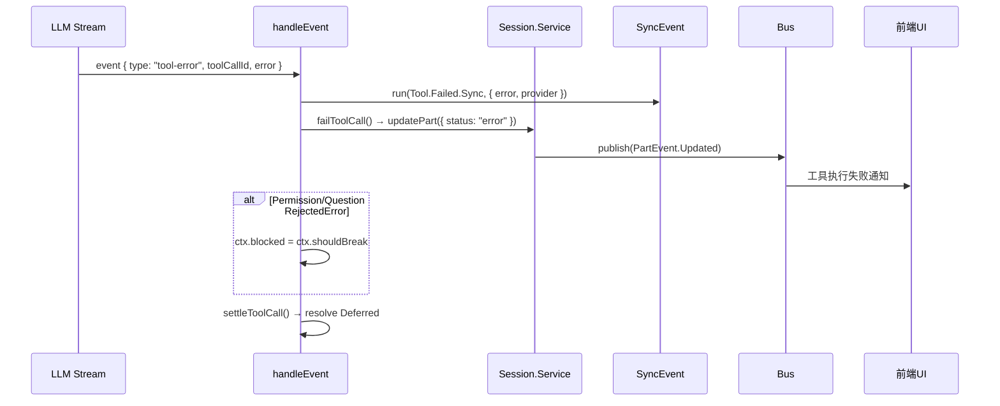

---

## 11. `"error"` 事件

> [`processor.ts:462-463`](../packages/opencode/src/session/processor.ts:462)

### 代码

```typescript
case "error":
  throw value.error
```

### 逻辑

直接抛出错误，由外层 `process` 管道处理：`catchCauseIf` → `retry(SessionRetry.policy)` → `catch(halt)`。

`halt()` 逻辑：
- `ContextOverflowError` → `ctx.needsCompaction = true` + Bus 错误通知
- 其他错误 → `Step.Failed` 同步事件 + `assistantMessage.error` + Bus 错误通知 + `status.set(idle)`

### 示例

```
API 返回 429 限流错误：
→ event { type: "error", error: APICallError { statusCode: 429, message: "Rate limit exceeded" } }
→ throw error → 被外层 catchCauseIf 捕获
→ SessionRetry.policy 判断：429 是可重试错误 → 等待 2s 后重试
→ 重试成功 → 继续处理流

API 返回 401 认证错误（不可重试）：
→ event { type: "error", error: APICallError { statusCode: 401 } }
→ throw error → 重试策略判断不可重试 → halt(error)
→ halt: 非 ContextOverflowError → sync.run(Step.Failed) + assistantMessage.error = APIError
→ status.set(idle) → UI：显示错误 "认证失败"

上下文溢出错误：
→ event { type: "error", error: ContextOverflowError { message: "Token usage exceeds limit" } }
→ throw error → 重试耗尽 → halt(error)
→ halt: ContextOverflowError → ctx.needsCompaction = true
→ process() 检测到 needsCompaction → 返回 "compact"
→ 上层 runloop 触发上下文压缩流程
```

### 时序图


---

## 12. `"start-step"` 事件

> [`processor.ts:465-487`](../packages/opencode/src/session/processor.ts:465)

### 代码

```typescript
case "start-step":
  if (!ctx.snapshot) ctx.snapshot = yield* snapshot.track()
  if (!ctx.assistantMessage.summary) {
    yield* sync.run(SessionEvent.Step.Started.Sync, { sessionID, agent, model, snapshot, timestamp })
  }
  yield* session.updatePart({ id: PartID.ascending(), messageID, sessionID, snapshot, type: "step-start" })
  return
```

### 逻辑

1. **快照捕获**：若 `ctx.snapshot` 为空，调用 `snapshot.track()` 获取 git tree hash（快照在 `create()` 时会预捕获一次）
2. **同步事件**（非 summary）：`session.next.step.started`，含 agent、model、snapshot
3. **持久化 StepStartPart**

### 示例

```
LLM 开始新一轮推理步骤：
→ event { type: "start-step" }
→ ctx.snapshot 为空（首次或前步已消费）→ snapshot.track()
  → 执行 git add -A && git write-tree → 返回 "abc1234"（当前工作区快照）
→ sync.run(Step.Started.Sync, { agent: "code", model: { id: "claude-3.5-sonnet", providerID: "anthropic" }, snapshot: "abc1234" })
→ updatePart({ type: "step-start", snapshot: "abc1234" })
→ UI：显示步骤分隔线 "Step 2"

快照已存在场景（由 create() 预捕获）：
→ ctx.snapshot = "abc1234"（不为空）
→ 不调用 snapshot.track()，直接使用已有快照
→ 原因：AI SDK 可能内部执行工具后再发 start-step，此时需要确保快照是最早的状态
```

### 时序图


---

## 13. `"finish-step"` 事件

> [`processor.ts:489-547`](../packages/opencode/src/session/processor.ts:489)

逻辑最复杂的事件，涉及用量计算、文件变更检测、摘要生成、溢出检测。

### 代码

```typescript
case "finish-step": {
  const completedSnapshot = yield* snapshot.track()
  const usage = Session.getUsage({ model: ctx.model, usage: value.usage, metadata: value.providerMetadata })
  if (!ctx.assistantMessage.summary) {
    yield* sync.run(SessionEvent.Step.Ended.Sync, { sessionID, finish, cost, tokens, snapshot, timestamp })
  }
  ctx.assistantMessage.finish = value.finishReason
  ctx.assistantMessage.cost += usage.cost
  ctx.assistantMessage.tokens = usage.tokens
  yield* session.updatePart({ id, reason, snapshot: completedSnapshot, type: "step-finish", tokens, cost })
  yield* session.updateMessage(ctx.assistantMessage)
  if (ctx.snapshot) {
    const patch = yield* snapshot.patch(ctx.snapshot)
    if (patch.files.length) {
      yield* session.updatePart({ id, type: "patch", hash: patch.hash, files: patch.files })
    }
    ctx.snapshot = undefined
  }
  yield* summary.summarize({ sessionID, messageID }).pipe(Effect.ignore, Effect.forkIn(scope))
  if (!ctx.assistantMessage.summary && isOverflow({ cfg: yield* config.get(), tokens, model })) {
    ctx.needsCompaction = true
  }
  return
```

### 逻辑

1. **完成时快照**：`snapshot.track()` 获取步骤结束时的文件系统状态
2. **用量计算**：`Session.getUsage()` 计算 token 用量和费用
3. **同步事件**（非 summary）：`session.next.step.ended`
4. **更新消息**：累积 cost、更新 tokens 和 finishReason
5. **持久化 StepFinishPart**
6. **更新消息**：`session.updateMessage()` 写入数据库
7. **文件变更检测**：`snapshot.patch()` 计算差异 → 若有变更创建 `PatchPart`，消费快照
8. **异步摘要**：`summary.summarize()` 在独立 fiber 中异步运行（不阻塞）
9. **溢出检测**：`isOverflow()` → `ctx.needsCompaction = true` → 流终止 → `process` 返回 `"compact"`

### 示例

```
完整场景：模型读取文件、修改文件、完成一轮推理

步骤开始时：ctx.snapshot = "abc1234"（记录了修改前的文件状态）
→ 模型执行 write_file 工具，修改了 /src/sort.ts
→ event { type: "finish-step", finishReason: "tool-calls", usage: { inputTokens: 5000, outputTokens: 800 } }

1. 完成时快照：snapshot.track() → "def5678"（修改后的文件状态）
2. 用量计算：getUsage() → { cost: 0.024, tokens: { input: 5000, output: 800 } }
3. 同步事件：Step.Ended.Sync { finish: "tool-calls", cost: 0.024, tokens: {...} }
4. 更新消息：assistantMessage.cost += 0.024, tokens = { input: 5000, output: 800 }
5. 持久化：updatePart({ type: "step-finish", reason: "tool-calls", cost: 0.024 })
6. 更新消息：updateMessage(assistantMessage) → 数据库
7. 文件变更检测：
   → snapshot.patch("abc1234") → git diff-tree "abc1234" vs "def5678"
   → Patch { hash: "patch_001", files: ["/src/sort.ts"] }
   → 有变更 → updatePart({ type: "patch", hash: "patch_001", files: ["/src/sort.ts"] })
   → ctx.snapshot = undefined（消费快照）
   → UI：显示"1 个文件被修改"标签
8. 异步摘要：summary.summarize() → 后台生成会话标题（不阻塞）
9. 溢出检测：isOverflow({ tokens: { input: 5000 }, model: { limit: { context: 200000 } } }) → false → 不需要压缩

上下文溢出场景：
→ 累积了大量对话历史，inputTokens = 190000
→ model.limit.context = 200000, reserved = 20000
→ usable = 200000 - 20000 = 180000
→ 190000 >= 180000 → isOverflow = true
→ ctx.needsCompaction = true
→ Stream.takeUntil(() => ctx.needsCompaction) 终止流
→ process() 返回 "compact" → runloop 触发上下文压缩

无文件变更场景：
→ 模型只做了文本回复，没有执行写文件工具
→ snapshot.patch("abc1234") → Patch { hash: "patch_002", files: [] }
→ files.length === 0 → 不创建 PatchPart
→ ctx.snapshot = undefined
```

### 时序图


---

## 14. `"text-start"` 事件

> [`processor.ts:549-566`](../packages/opencode/src/session/processor.ts:549)

### 代码

```typescript
case "text-start":
  if (!ctx.assistantMessage.summary) {
    yield* sync.run(SessionEvent.Text.Started.Sync, { sessionID, timestamp })
  }
  ctx.currentText = {
    id: PartID.ascending(), messageID, sessionID, type: "text",
    text: "", time: { start: Date.now() }, metadata: value.providerMetadata,
  }
  yield* session.updatePart(ctx.currentText)
  return
```

### 逻辑

1. **同步事件**（非 summary）：`session.next.text.started`
2. **创建 TextPart**：空文本、起始时间、providerMetadata，存入 `ctx.currentText`
3. **持久化**：`session.updatePart()`

### 示例

```
模型开始输出文本回复：
→ event { type: "text-start", providerMetadata: null }
→ currentText = { type: "text", text: "", time: { start: 1715800010000 } }
→ updatePart(currentText) → UI：渲染一个空的文本区域

Summary 模式场景：
→ ctx.assistantMessage.summary 存在（正在压缩摘要）
→ 不发送同步事件（summary 不对外广播）
→ 但仍然创建 TextPart 和持久化（summary 内容也需要存储）
```

### 时序图


---

## 15. `"text-delta"` 事件

> [`processor.ts:568-584`](../packages/opencode/src/session/processor.ts:568)

### 代码

```typescript
case "text-delta":
  if (!ctx.currentText) return
  ctx.currentText.text += value.text
  if (value.providerMetadata) ctx.currentText.metadata = value.providerMetadata
  yield* session.updatePartDelta({ sessionID, messageID, partID, field: "text", delta: value.text })
  yield* sync.run(SessionEvent.Text.Delta.Sync, { sessionID, delta: value.text, timestamp })
  return
```

### 逻辑

1. **存在性检查**：`ctx.currentText` 为空则跳过
2. **内存追加**：`currentText.text += value.text`
3. **增量持久化**：`session.updatePartDelta()`
4. **同步事件**：`session.next.text.delta`

### 示例

```
模型流式输出回复，每个 token 触发一个 delta：
→ event { type: "text-delta", text: "这是" }
→ currentText.text = "这是"
→ event { type: "text-delta", text: "一个" }
→ currentText.text = "这是一个"
→ event { type: "text-delta", text: "快速" }
→ currentText.text = "这是一个快速"
→ event { type: "text-delta", text: "排序" }
→ currentText.text = "这是一个快速排序"
→ UI：实时追加渲染文本（打字机效果）

currentText 为空的异常场景（事件乱序）：
→ 如果 text-delta 在 text-start 之前到达（理论上不应发生）
→ ctx.currentText === undefined → return（跳过，等待 text-start）
```

### 时序图


---

## 16. `"text-end"` 事件

> [`processor.ts:586-613`](../packages/opencode/src/session/processor.ts:586)

### 代码

```typescript
case "text-end":
  if (!ctx.currentText) return
  ctx.currentText.text = ctx.currentText.text                    // 响应式触发
  ctx.currentText.text = (yield* plugin.trigger(
    "experimental.text.complete",
    { sessionID, messageID, partID }, { text: ctx.currentText.text },
  )).text
  if (!ctx.assistantMessage.summary) {
    yield* sync.run(SessionEvent.Text.Ended.Sync, { sessionID, text, timestamp })
  }
  { const end = Date.now(); ctx.currentText.time = { start: ctx.currentText.time?.start ?? end, end } }
  if (value.providerMetadata) ctx.currentText.metadata = value.providerMetadata
  yield* session.updatePart(ctx.currentText)
  ctx.currentText = undefined
  return
```

### 逻辑

1. **存在性检查**：`ctx.currentText` 为空则跳过
2. **响应式触发**：`text = text` 自赋值
3. **插件钩子**：`experimental.text.complete` — 唯一的插件干预点，可修改最终文本
4. **同步事件**（非 summary）：`session.next.text.ended`
5. **全量更新**：`session.updatePart()` 完整替换 part
6. **清理**：`ctx.currentText = undefined`

### 示例

```
正常文本完成：
→ event { type: "text-end" }
→ currentText.text = "这是一个快速排序算法的实现"
→ plugin.trigger("experimental.text.complete", { text: "这是一个快速排序算法的实现" })
  → 无插件注册 → 返回原文本
→ sync.run(Text.Ended.Sync, { text: "这是一个快速排序算法的实现" })
→ currentText.time.end = 1715800015000
→ updatePart(currentText) → 数据库全量更新
→ currentText = undefined

插件修改文本场景：
→ plugin.trigger("experimental.text.complete", { text: "密码是 secret123" })
  → 安全过滤插件检测到敏感信息
  → 返回 { text: "密码是 [REDACTED]" }
→ currentText.text = "密码是 [REDACTED]"（文本被修改）
→ sync.run(Text.Ended.Sync, { text: "密码是 [REDACTED]" })
→ 最终存储的是过滤后的文本

计时场景：
→ currentText.time = { start: 1715800010000, end: 1715800015000 }
→ UI：显示"生成耗时 5 秒"
```

### 时序图

```mermaid
sequenceDiagram
    participant Stream as LLM Stream
    participant HE as handleEvent
    participant Ctx as ctx.currentText
    participant Plugin as Plugin.Service
    participant Sync as SyncEvent
    participant Session as Session.Service

    Stream->>HE: event { type: "text-end" }
    HE->>Ctx: text = text (响应式触发)
    HE->>Plugin: trigger("experimental.text.complete", { text })
    Plugin-->>HE: { text: possiblyModified }
    alt 非 summary
        HE->>Sync: run(Text.Ended.Sync, { text })
    end
    HE->>Ctx: time.end = Date.now()
    HE->>Session: updatePart(finalTextPart)
    HE->>Ctx: currentText = undefined
```

---

## 17. `"finish"` 事件

> [`processor.ts:615-616`](../packages/opencode/src/session/processor.ts:615)

### 代码

```typescript
case "finish":
  return
```

### 逻辑

空操作。实际收尾由 `process` 函数的 `Effect.ensuring(cleanup())` 和流结束后的返回值判断完成。

### 示例

```
LLM 流结束：
→ event { type: "finish" }
→ return（不做任何处理）

后续流程（不在 handleEvent 中，而在 process() 中）：
1. Stream.runDrain 完成
2. Effect.ensuring(cleanup()) 触发：
   - 保存未消费的 snapshot patch
   - 关闭未完成的 currentText（设 time.end）
   - 关闭未完成的 reasoningMap 条目
   - 等待所有 toolcalls 的 Deferred（最多 250ms）
   - 将仍在 running 的工具标记为 error("Tool execution aborted")
   - 设置 assistantMessage.time.completed
3. 判断返回值：
   - needsCompaction? → "compact"
   - blocked || error? → "stop"
   - 否则 → "continue"（继续 runloop 循环）
```

---

## 18. `default` — 未知事件

> [`processor.ts:618-620`](../packages/opencode/src/session/processor.ts:618)

### 代码

```typescript
default:
  slog.info("unhandled", { event: value.type, value })
  return
```

### 逻辑

仅记录日志，不抛错。防御性编程。

### 示例

```
AI SDK 新增了事件类型（如 "reasoning-summary-delta"）：
→ event { type: "reasoning-summary-delta", ... }
→ slog.info("unhandled", { event: "reasoning-summary-delta", value: {...} })
→ return（不影响已支持的事件处理）

设计意义：新版本 AI SDK 可能新增事件类型，default 分支确保不会导致处理器崩溃，
只是静默忽略，等待 opencode 适配新事件。
```

---

## 附录：事件处理总览

| 事件 | 行号 | 下游服务 | ctx 状态变更 | 关键副作用 |
|------|------|---------|-------------|-----------|
| `start` | 226-228 | status | - | 设置会话 busy |
| `reasoning-start` | 230-247 | sync, session | reasoningMap += | 创建 ReasoningPart |
| `reasoning-delta` | 249-266 | session, sync | reasoningMap[id].text += | 增量更新 |
| `reasoning-end` | 268-282 | sync, session | delete reasoningMap[id] | 全量更新+时间 |
| `tool-input-start` | 284-310 | sync, session | toolcalls += | 创建 ToolPart(pending) + Deferred |
| `tool-input-delta` | 312-319 | sync | - | 仅事件通知 |
| `tool-input-end` | 321-329 | sync | - | 仅事件通知 |
| `tool-call` | 331-387 | session, sync, agents, permission | - | pending→running + 末日循环检测 |
| `tool-result` | 389-442 | session, sync | delete toolcalls[id] | running→completed |
| `tool-error` | 444-460 | session, sync | blocked?, delete toolcalls[id] | running→error + blocked? |
| `error` | 462-463 | (外层处理) | needsCompaction? | 抛出异常 |
| `start-step` | 465-487 | snapshot, sync, session | snapshot? | 创建 StepStartPart |
| `finish-step` | 489-547 | snapshot, sync, session, summary, config | snapshot=undefined, needsCompaction? | StepFinish + Patch + 摘要 + 溢出检测 |
| `text-start` | 549-566 | sync, session | currentText += | 创建 TextPart |
| `text-delta` | 568-584 | session, sync | currentText.text += | 增量更新 |
| `text-end` | 586-613 | plugin, sync, session | currentText=undefined | 插件钩子+全量更新 |
| `finish` | 615-616 | - | - | 空操作 |
| `default` | 618-620 | slog | - | 记录日志 |

### `process` 返回值与 ctx 状态的关系

```typescript
if (ctx.needsCompaction) return "compact"                              // finish-step / error 触发
if (ctx.blocked || ctx.assistantMessage.error) return "stop"           // tool-error / error 触发
return "continue"                                                      // 正常继续循环
```